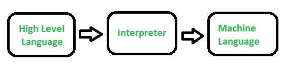

1.What is Interpreter?
    An interpreter is a computer program that translates and executes instructions written in a high-level programming language, one line at a time, without needing to compile the entire program first. Essentially, it acts as a translator that directly runs code, making it easier to test and debug, though potentially slower than compiled code.
    

In JavaScript,
   hoisting is the behavior where the JavaScript interpreter moves variable and function declarations to the top of their respective scope (either the global scope or the function's scope) during the compilation phase, before the code is executed. This means you can use variables and functions before they are actually declared in your code. 
Elaboration:
What is hoisting?
    Hoisting is a JavaScript mechanism that makes it seem like variable and function declarations are moved to the top of their scope, even if they are written later in the code. 
How it works:
    During the compilation phase, the JavaScript engine scans the code and creates a record of all variable and function declarations. It then "hoists" these declarations to the top of their scope, but the actual assignments (like x = 10) remain in their original locations. 
Variables:
    Variables declared with var are hoisted and initialized with undefined. 
    Variables declared with let and const are also hoisted, but they are not initialized. Attempting to access them before their declaration results in a ReferenceError. This period before initialization is called the Temporal Dead Zone (TDZ). 
Functions:
    Function declarations (like function myFunction() { ... }) are fully hoisted, meaning you can call them before their declaration. 
    Function expressions (like const myFunction = function() { ... }) are not fully hoisted; they behave like variable declarations. 
Why is hoisting useful?
    Code organization: Hoisting can allow for more flexible code organization, as you can write functions before their calls. 
Avoids errors: While not always a recommended practice, it can help avoid ReferenceErrors when accessing variables before they are declared in the code. 